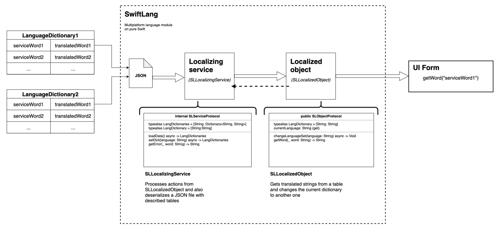

# SwiftLang

Multi-platform localization module on pure Swift.

This small module allows you to embed a centralized localization system into your multi-platform applications. Provides "SLLocalizedObject" to get a set of translated words, as well as "SLLocalizingService" needed to deserialize dictionaries stored in the JSON file and handle requests from "SLLocalizedObject".

## Schema


## Requirements
- swift-tools-version:5.3 or higher

## Installation

### Swift Package Manager
Create a new package with 
```bash
$ swift package init
```

or use a ready-made package. Open manifest file `Package.swift` and add dependencies: 

```swift
let package = Package(
  name: "TestProject",
  dependencies: [
    .package(url: "https://github.com/DevilSmith/swiftlang", .branch("main"))
  ],
  targets: [
    .target(name: "TestProject", dependencies: ["SwiftLang"])
  ]
)
```

## Usage
In order to start working with SwiftLang you need to create a JSON file (or several) in a convenient place in the project, in which dictionaries (language sets) will be described. The structure of the JSON file should match the example below:

```json
{
   "en":{
      "hello":"Hello",
      "world":"World !"
   },
   "ja":{
      "hello":"こんにちは",
      "world":"世界 ！"
   }
}
```
Next, you need to import SwiftLang into the project code:
```swift
import SwiftLang
```
Create an instance of "SLLocalizedObject" and write the path to the JSON file as a URL in the instance constructor:
```swift
//Other code...

    //Declaring SLLocalizedObject
    let localization: SLLocalizedObject
    
    //Class initializer or any other method:
    init(){
        
        //Get path as URL in project to Dictionaries.json
        guard let pathToDictionary = Bundle.main.url(forResource: "Dictionaries", withExtension: "json") else {
            fatalError("This file does not exist")
        }
        
        //Defining instance
        localization = SLLocalizedObject(language: "en", urlPathToDictionary: pathToDictionary)
        
    }
    
//Other code...
```
